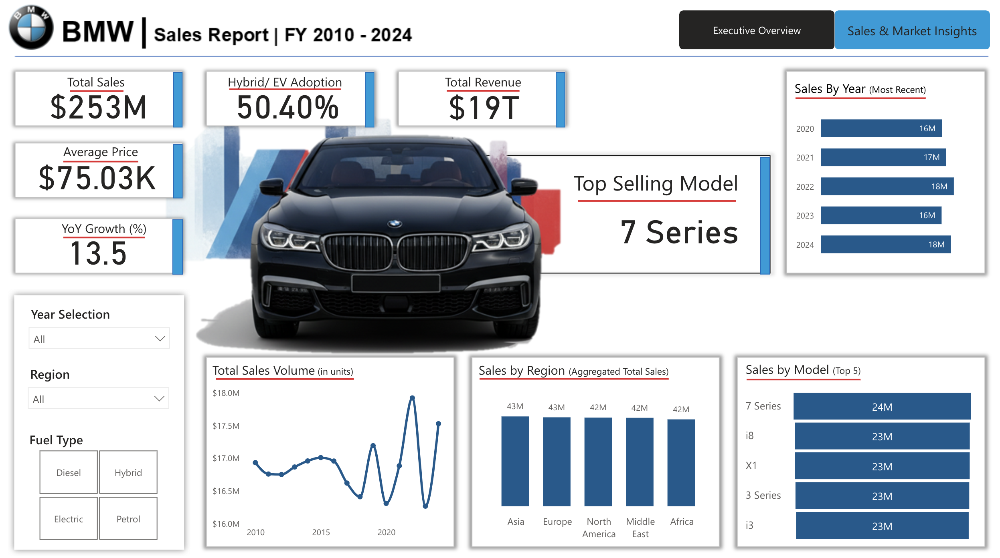
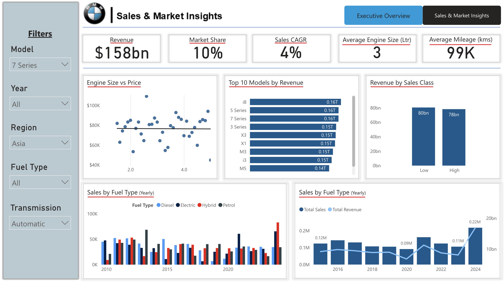

# 🚗 BMW Sales Analytics Dashboard (2010–2024)
A Power BI end-to-end analytics project exploring **BMW’s global sales, pricing, fuel-type trends, and model performance** between **2010 and 2024**.  
The report delivers deep insights into BMW’s portfolio across regions, engine sizes, fuel types, and vehicle classes.

---

## 📊 Project Overview
This project demonstrates the ability to:
- Design professional multi-page Power BI dashboards  
- Build data models with DAX, relationships, and date intelligence  
- Create meaningful business insights from raw automotive sales data  
- Combine technical analysis with executive-level storytelling

The dataset includes:
- **Models** (e.g., 3 Series, 5 Series, X Series, i Series)  
- **Regions**  
- **Fuel Types** (Diesel, Petrol, Electric, Hybrid)  
- **Engine Size**  
- **Mileage (KM)**  
- **Price (USD)**  
- **Sales Volume**  
- **Sales Classification** (High / Low)  
- **Year (2010–2024)**  

---

## 🧠 Key Insights (Executive Summary)

### **1️⃣ Global Performance (2010–2024)**
- Total revenue exceeded **$19T** across the period.  
- Annual sales trend shows steady growth, with sharp increases in **2016, 2018, and 2024**.  
- BMW maintains strong global presence — **Asia, Europe, North America, Middle East, and Africa** contribute evenly (≈42–43M units each in selected years).

---

### **2️⃣ Top Performing Models**
- **7 Series** is the top-selling model by volume and revenue.  
- Other consistently strong performers include:
  - **i8**
  - **X1**
  - **3 Series**
  - **i3**
- High-class models (performance or premium) contribute nearly **50%** of total revenue.

---

### **3️⃣ Pricing & Engine Trends**
- Average BMW price over the dataset sits around **$75K**.  
- Scatter plot analysis shows a **positive relationship** between **engine size** and **price** — premium engines command higher pricing.  
- However, price variation is also influenced by **model line, fuel type, and region**.

---

### **4️⃣ Fuel Type Evolution**
- Diesel and Petrol dominated early years (2010–2015).  
- Electric and Hybrid share increased significantly, reaching **~50% EV/Hybrid adoption** in most recent years.
- EV growth aligns strongly with rising consumer preference and global sustainability shift.

---

### **5️⃣ Regional Insights**
- Sales distribution by region is balanced, showing BMW’s **strong global market penetration**.
- Asia and Europe remain high-value markets with sustained demand for premium models.
- North America shows higher preference for larger engine models and SUVs.

---

### **6️⃣ YoY Growth & Recent Performance**
- YoY growth peaks in years with new model launches or electric vehicle expansions.  
- Most recent years (2022–2024) show excellent rebound and strong upward trend.  

---

## 📈 Dashboard Features

### **Page 1 — Executive Overview**
- Total Sales, Total Revenue, Average Price  
- YoY Growth (%)  
- EV/Hybrid Adoption (%)  
- Top Selling Model  
- Sales by Region  
- Sales by Year (Recent Window)  
- Sales Volume Trend  
- Top 5 Models by Sales

### **Page 2 — Sales & Market Insights**
- Revenue, Market Share, Sales CAGR  
- Engine Size vs Price (Scatter Plot)  
- Revenue by Sales Class  
- Top 10 Models by Revenue  
- Sales by Fuel Type (Yearly)  
- Full Filter Panel:
  - Model  
  - Year  
  - Region  
  - Fuel Type  
  - Transmission  

---
